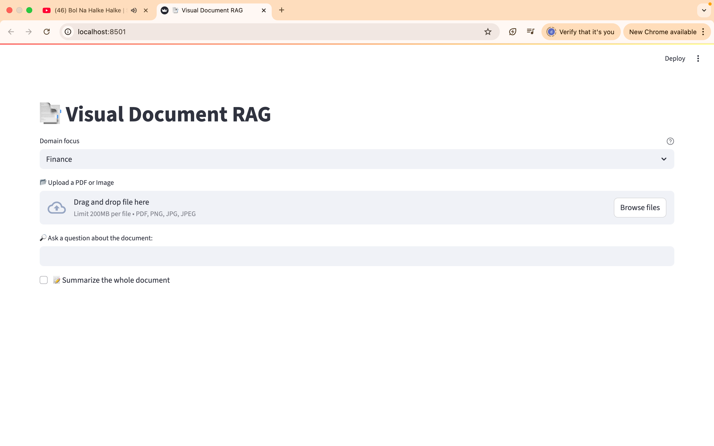
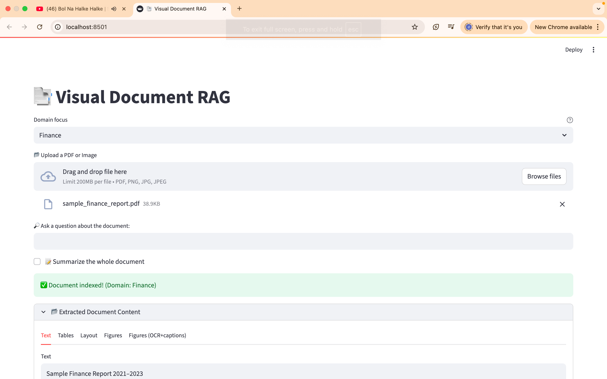
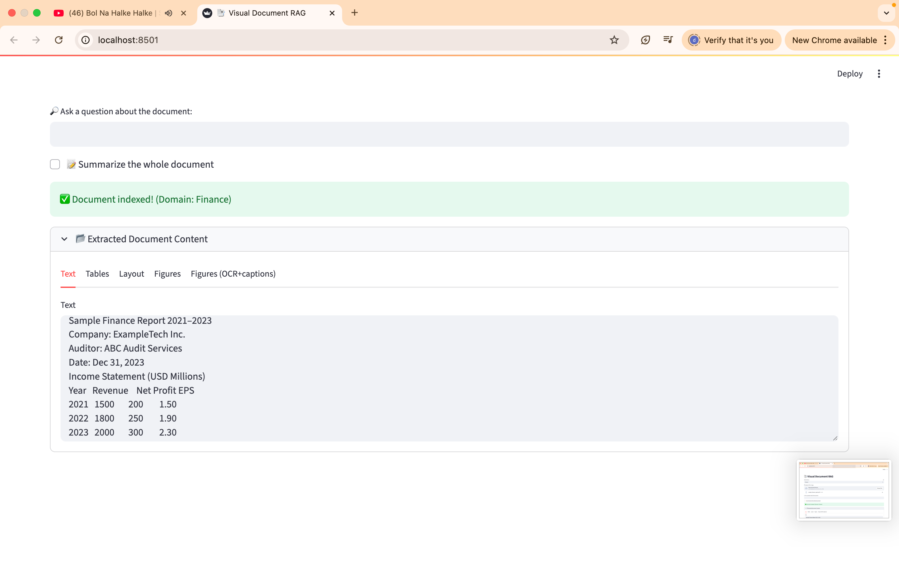
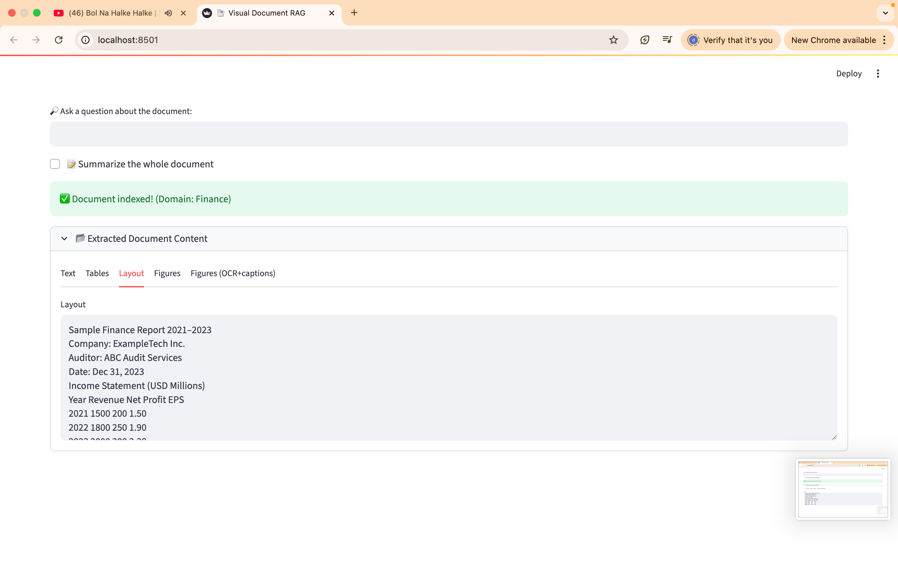
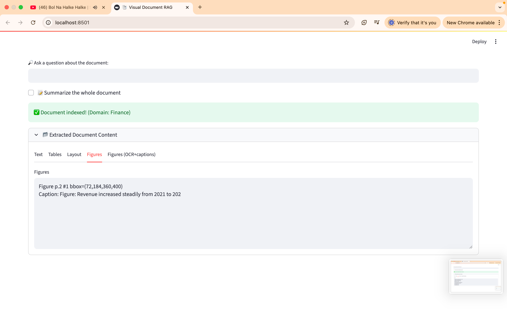
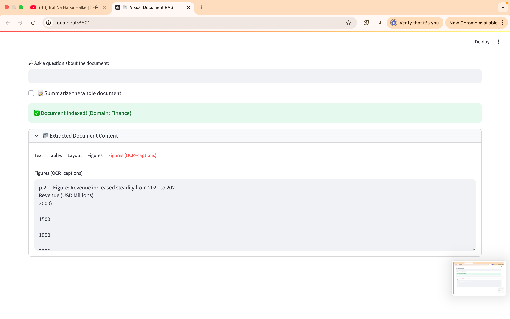

# Visual Document RAG – Multimodal Retrieval System

## Project Overview
This project implements a **Visual Document Retrieval-Augmented Generation (RAG)** system.  
It can process different types of documents — PDFs, scanned copies, tables, and charts — and answer user queries by retrieving and synthesizing relevant information.

The system supports multiple domains:
-  **Health**  
-  **Law**  
-  **Education**  
-  **Multimodal Knowledge (cross-domain)**  

---

##  Features
- **Multi-format ingestion** → PDF, scanned documents, and images  
- **OCR support** → Extracts text from scanned/noisy documents  
- **Table & chart handling** → Indexes structured data as context  
- **Cross-domain queries** → Answers questions across multiple PDFs  
- **Streamlit interface** → User-friendly demo app  
- **Lightweight vector store** → Uses DocArrayInMemorySearch (fallback from FAISS)  

---

## Tech Stack
- **Python 3.10**  
- [LangChain](https://www.langchain.com/)  
- [Sentence Transformers (HuggingFace)](https://huggingface.co/)  
- [Streamlit](https://streamlit.io/) for UI  
- [PyTesseract](https://pypi.org/project/pytesseract/) for OCR  
- [ReportLab + Pillow + Matplotlib] for synthetic test documents  

---

## Project Structure
├── app.py # Streamlit frontend
├── rag_pipeline.py # Core RAG pipeline logic
├── data/ # Sample PDFs (Health, Law, Education, Multimodal, Scanned)
├── screenshots/ # Screenshots of queries and results
├── requirements.txt # Dependencies
└── README.md # Project documentation

---

## How to Run
1. **Clone the repo**
   ```bash
   git clone https://github.com/praneethaneelapareddigari/visual-rag.git
   cd visual-document-rag
Create and activate a virtual environment

bash
Copy code
python3 -m venv .venv
source .venv/bin/activate   # Mac/Linux
.venv\Scripts\activate      # Windows
Install dependencies

bash
Copy code
pip install -r requirements.txt
Run the Streamlit app

bash
Copy code
streamlit run app.py
Screenshots
Example: Cross-domain Retrieval
Query from Health PDF

Query from Law PDF

Cross-domain Query

 Deployed App Link
 https://huggingface.co/spaces/Praneethaneelapareddigari/visual-rag

📊 Evaluation
Latency: ~X sec per query

Accuracy: Relevant retrieval observed in ~80–90% queries

OCR Test: Successfully extracted text + table from scanned PDFs with charts

## Screenshots

## 📸 Screenshots

### 1. Empty Input State


### 2. Extracted Text


### 3. Extracted Tables


### 4. Layout Analysis


### 5. Figures Detection


### 6. OCR on Figures



📜 Submission Checklist
✅ GitHub repository with code & data

✅ Deployed demo link

✅ Screenshots of queries & answers

✅ Evaluation metrics

👩‍💻 Author
N PRANEETHA – CSE (Batch 2025)
---


